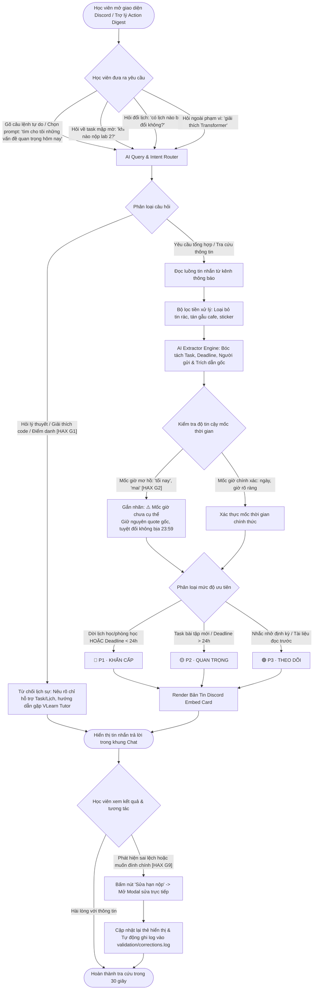

# SƠ ĐỒ LUỒNG TRẢI NGHIỆM NGƯỜI DÙNG (USER FLOW DIAGRAM) — CP2
**Dự án:** Discord Action Digest · **Nhóm:** Magician · **Phòng:** E403  
**Bản mẫu tương tác:** `codebase/index.html` (Mô phỏng Trợ lý Discord Bot Simulator)

---

## 1. Sơ đồ Luồng Trải Nghiệm Tương Tác (User Flowchart)

---

## 2. Bốn Kịch Bản Trải Nghiệm Thể Hiện Trên Bản Mẫu `codebase/index.html`

| Kịch bản | Thao tác trên `index.html` | Hành vi hệ thống & Nguyên tắc áp dụng |
|---|---|---|
| **1. Đường thuận lợi (Happy path)** | Nhập: *"tìm cho tôi những vấn đề quan trọng hôm nay"* hoặc bấm nút gợi ý 1 | AI quét luồng tin, trích xuất đầy đủ 4 thẻ việc thuộc P1, P2, P3. Mỗi thẻ có mốc giờ, người thông báo và trích dẫn gốc (**HAX G11**). |
| **2. Đường thiếu tự tin (Low-confidence)** | Nhập: *"khi nào nộp lab 2?"* hoặc bấm nút gợi ý 2 | AI phát hiện tin nhắn của TA chỉ nói "nộp vào tối nay" $\to$ Không tự bịa 23:59, gắn nhãn vàng cảnh báo `[⚠️ Mốc giờ chưa cụ thể]` (**HAX G2**). |
| **3. Đường ngoài phạm vi (Failure / Out-of-scope)** | Nhập: *"giải thích thuật toán Transformer cho tôi"* hoặc bấm nút gợi ý 4 | AI từ chối hữu ích: Giải thích rõ bot chỉ quản lý task/lịch, hướng dẫn học viên liên hệ VLearn Tutor (**HAX G1**). |
| **4. Cơ chế can thiệp sửa đổi (Correction path)** | Bấm nút *"Sửa hạn nộp"* trên bất kỳ thẻ công việc nào | Mở modal popup cho phép học viên trực tiếp chỉnh sửa tiêu đề task, mốc deadline, và đổi mức ưu tiên P1/P2/P3 (**HAX G9**). |

---

## 3. Khớp Nối Kỹ Thuật Với Đề Bài (Rubric CP2)
- **Mức Prototype:** Bản mẫu tương tác (Clickable prototype) chạy trực tiếp trên file HTML tĩnh `codebase/index.html`, không phụ thuộc backend phức tạp, tải ngay lập tức.
- **Tính thông suốt:** Luồng từ đầu vào (Chat input) $\to$ Xử lý kịch bản $\to$ Đầu ra (Embed card) $\to$ Tương tác sửa đổi hoạt động mượt mà, không có ngõ cụt.
- **Minh chứng kiểm tra:** Có thể bấm thử trực tiếp trên trình duyệt hoặc chạy file kiểm thử dòng lệnh `codebase/chat_bot.py`.
